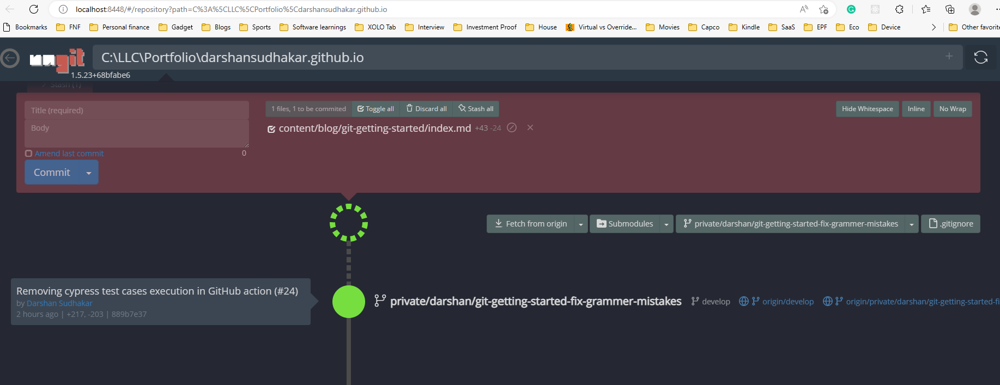

Git is like driving a motorcycle or a car for the first time. We would sweat the crap out on day 1. But, by the time we reach day 10 it is like walk in a park 🌳🏃‍♀️🌳

Learning Git is easy when Git is our first source control tool. Now, you might be thinking what is this source control tool. Source control tool is a common place where we save all our source code. Tomorrow when a new developer joins the project; developer can access all code at one place.

Git is one of the source control tools. We also have others like

* TFS

* SVN

* Perforce

Dont worry about these names now. But, make sure you memorize these names to show off in front of your boss :wink: There is a good chance that your boss must have used these tools.

If you are somebody who is already aware of other source control tools like SVN, Perforce, or TFS. Then understand Git becomes tougher. Why? Because, you gotta unlearn the old tools and re-learn this new tools. It is a little painful :syringe: ; I felt the same when I had to learn Git. So, you are not alone.

The intension of this blog is to make Git journey a little painless :pill:

An [XKCD](https://xkcd.com/1597/) cartoon below points out one of the difficulty of Git. But trust me these short terms pain are worth long term gains.

## So what is Git?

It is a Distributed Version Control System. Or, in simple words we use Git to save code in a common place when all the developers can access. It not only saves the code but also keeps track of the history changes that were being made to the source code over a long period of time.

Git can also be used to store other digital information. I use Git to store free eBooks, Notes, PDFs, sketch notes and sometimes even data (For AI & ML).

It also supports multiple simultaneous saves by multiple users at the same. Cool na! But how? We will learn as you go on.

## So why use only Git? Why not continue to use the others?

Git is famous among Open source software development community. Almost every commercial software firm uses Git. Git saves a lot of time in branching and merging.

Long ago when I started my career as a fresher. We used Tortoise SVN as a source control tool. I was given the job of branching and merging at the begining of every sprint. We used to take good two days to branch and merge using a Tortoise SVN repository. Whereas, in Git, it takes a few minutes to branch and merge. This was one of the primary reasons why people and organisations embrace Git.

## How to use Git?

The textbook way to start learning Git is with commands. Git commands are great. However, by using only command it becomes a little difficulat to understand Git.

Therefore, we need a visualization tool to understand Git. Git on Visual Studio Code with a Visulization tool called Ungit is a good way to learn Git.

## So how do we go about learning Git

Here is the set of steps that has helped me understand Git

1. Install Visual Studio Code
2. Watch this recommended [Git video on YouTube](https://youtu.be/IHaTbJPdB-s?t=527). This is just the stepping stone to understand Git.
3. Just follow the steps that is shown in video to create a repo and to clone the repo (For those who do not have access to YouTube at the office can easily watch using their smart phones and follow)
4. There is a Git visualization tool called [Ungit](https://github.com/FredrikNoren/ungit). Using Ungit you could visualize what is actually happening with each Git command. To understand Ungit please watch this [video](https://youtu.be/hkBVAi3oKvo).
Here is the ungit screenshot of repo of this blog post

5. Now open git [cheat sheet](https://github.github.com/training-kit/) and try to reading more about each commands and experiment

By following the above steps you would have a decent amount of knowledge on Git. However, to progress further we have know how Git branching and merging works. More importantly we gotta visualize how branching and merging happens in Git. This can be easily done by using [Learn Git Branching](https://learngitbranching.js.org/) tool.

## Final opinion

It took me some time to learn and understand the basic elements of Git. The most important ourcome was that I retained what I learned for a really long time.

So, folks, just play around with the above tools.

### Other tools worthy of a mention

* <https://git-scm.com/download/gui/win>

* <http://git-school.github.io/visualizing-git/>

## References

* [Google trends](https://trends.google.com/trends/explore?date=all&geo=US&q=git,svn)

* [Stack exchange](https://softwareengineering.stackexchange.com/questions/136079/are-there-any-statistics-that-show-the-popularity-of-git-versus-svn)

* [Stack Overflow Survey 2022 - Version Control](https://survey.stackoverflow.co/2022/#technology-version-control)

* [XKCD](https://xkcd.com/)
