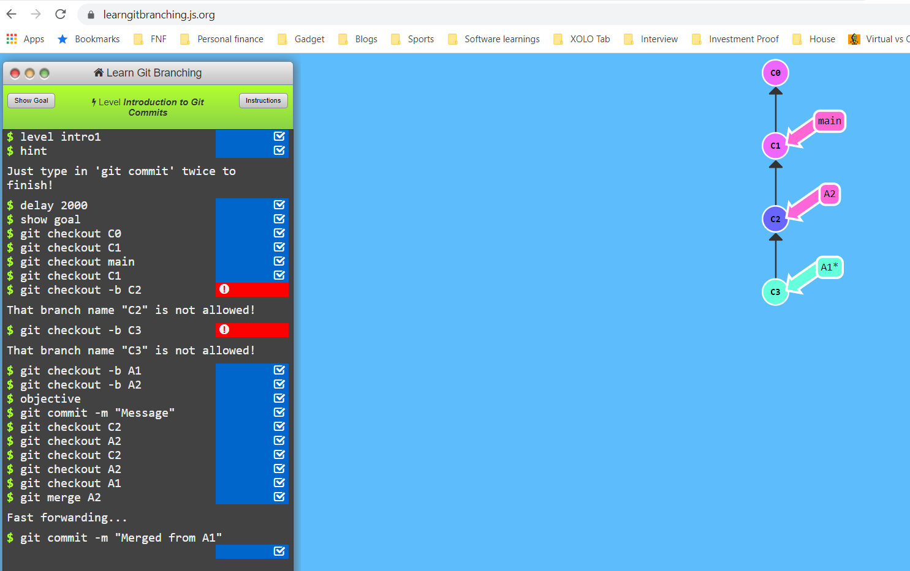

Git is not that complicated as it seems to be. It is just like driving a motorcycle for the first time. We would sweat the crap out on day 1. By the time we reach day 10 its like walking in a park. 

Learning Git is easy when Git is our first source code version control tool. Now, you might be thinking what is a source control tool. Source control tool is a place where we save all our source code. Some examples of source control tools are Git, TFS, SVN and Perforce (Dont worry about these names now. But, make sure memorize these names later to show off in front of your boss :wink:)

If you are somebody who is already aware of other version control tools like SVN, Perforce, or TFS. The it becomes tough to understand Git. Why? Because, you gotta unlearn the old ways and re-learn this new thing. I agree it is a little painful :syringe: ; felt the same when I had to learn Git. I really feel for you. 

The intension of this blog is to make this journey a little painless :pill:

[XKCD](https://xkcd.com/) cartoon beow excellently points out on how difficult the product is. But trust me these short terms pain are worth long term gains.

## So what is Git?

It is a Distributed Version Control System. Or, in simple words you use Git to checkin code. It not only saves the code but also keeps track of changes that were being made to the source code over a period of time. 

However, Git can also be used to store other digital information. I use Git to store eBooks, Notes, PDFs, sketch notes and sometimes even data (For AI & ML). It also supports multiple saves by multiple users at the same. Cool na!

## So Why use only Git? Why not continue to use the others?

Git is famous among Open source software development community and now almost every commercial software entity uses Git. Git saves a lot of time in branching and merging. Let me tell you a story of mine. Long ago when I started as a fresher. We used Tortoise SVN as a source control tool. I was given the job of merging and branching at the begining of every sprint. And it used to take good two days to branch and merge three source control repository. 

The organisation wanted to be more agile so they had to introduce Git. Git takes a few minutes to branch and merge. This was one of the reasons people and organisations embraced Git.

## How to use Git?

We start with commands while learn Git. Git commands are great. However, it is not the best way to understand Git.

## So how do we go about learning Git

We need to understand Git theoritically first. Below is the aproach that had worked for me

Things to do before you start

1. Install Visual Studio Code and create a Github repository (You can also use BitBicket, Azure Devops or any other source control site)
2. Try creating a branch from Visual Studio Code. Refer any Youtube video to do this
3. Here is an important step. We need visualize what is happening with each command. So we use the repo visualization tool [Ungit](https://github.com/FredrikNoren/ungit). There is a nice [video](https://youtu.be/hkBVAi3oKvo) about Ungit.
4. Ungit has an extension in Visual Studio Code. Install the extension and see the magic. It visualizes Git operations. The next step would be to try creating a new branch and merging it into main branch using Visual Studio Code.
5. Now open git [cheat sheet](https://github.github.com/training-kit/) and try to understand the commands

By following the above steps you would have now become a master of the Git ecosystem. However, we have know how Git branching and merging works. More importantly we gotta visualize how branching and merging happens in Git. This can be easily done by using [Learn Git Branching](https://learngitbranching.js.org/) tool. All you have to do is to play around with this tool. 

IDEs like Visual Studio or VS Code have Git software built into them. So you can use Git directly inside these IDEs as well.

## Final opinion

It took me some time to learn and understand the basic elements of Git. But by using the above method I retained what I learned for a really long time. This indeed helped me show off in front of my manager.

### Other tools worthy of a mention

- <https://git-scm.com/download/gui/win>
- <http://git-school.github.io/visualizing-git/>

## References

- [Google trends](https://trends.google.com/trends/explore?date=all&geo=US&q=git,svn)
- [Stack exchange](https://softwareengineering.stackexchange.com/questions/136079/are-there-any-statistics-that-show-the-popularity-of-git-versus-svn)
- [XKCD](https://xkcd.com/)
